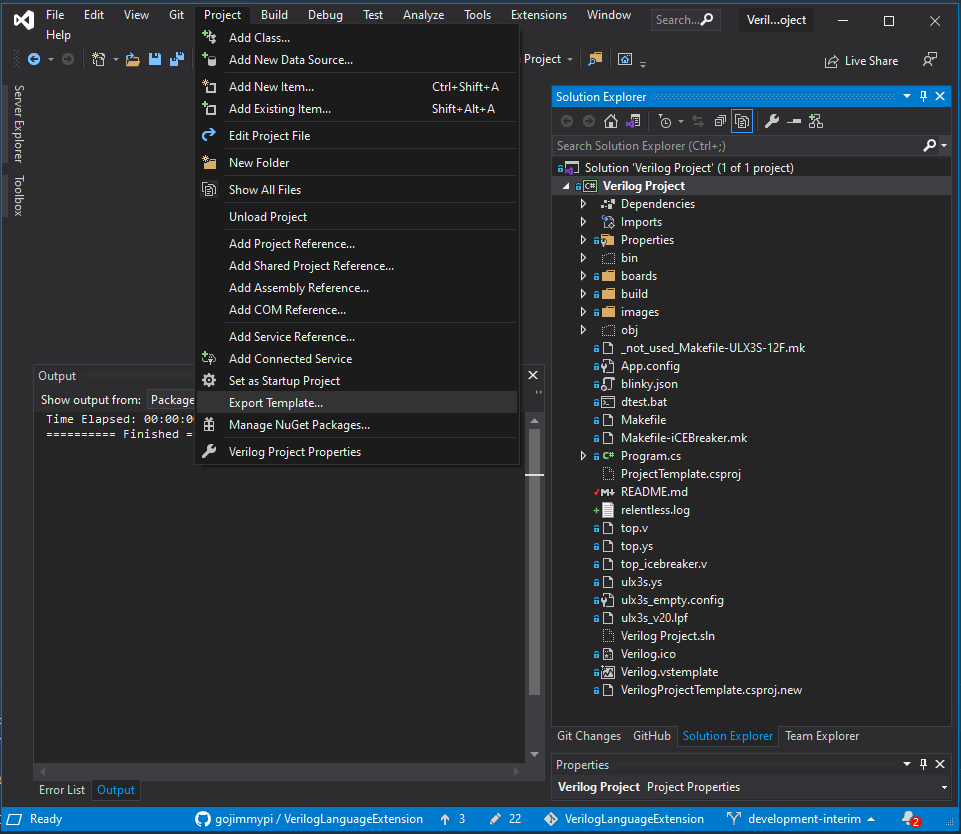
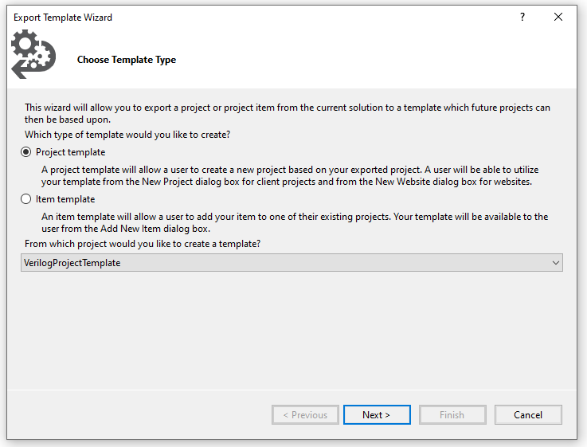

# Added Extension Project Templates

Each of the subdirectories here contain files that are created during `File - New Project` in Visual Studio. All of the files will be copied to the respective new project.

These directories are NOT part of the Verilog Language Extension development solution and should be zipped up (via the Export Template...) and included in the `.\ProjectTemplates\` directory for distribution with installation files.

If these projects are added to the main solution, a large number of (probably undesired) build configurations for the FPGA board will be added to that solution.

Instead, when editing these project templates, open the respective solution file. For example the [VerilogProject.sln](./VerilogProject/VerilogProject.sln) in
`AddedExtensionProjectTEmplate/VerilogProject/`

See also the [VerilogProject/README.md](./VerilogProject/README.md) file.

## Rapid Development

Edit a sample VerilogProject, typically numbered in:

```text
C:\Users\%USERNAME%\source\repos\VerilogProject[N]\VerilogProject3\VerilogProject[N].csproj
```

Once confirmed, copy back to

```text
C:\workspace\VerilogLanguageExtension\AddedExtensionProjectTemplates\VerilogProject\VerilogProject.csproj
```

**WARNING** Do not blindly copy project file back: check for username specific updates to the Verilog Project `.csproj` file.

## Slow Development

Reinstall VSIX only when template creation changes

You need the batch reinstall only when changing things that affect creating a new project, such as:

- `AddedExtensionProjectTemplates\VerilogProject\Verilog.vstemplate`
- `source.extension.vsixmanifest`
- `tools\templates\Build-ProjectTemplates.ps1`
- `tools\templates\Test-ProjectTemplate.ps1`
- `ProjectTemplates\CSharp\1033\VerilogProject.zip` generation

## Avoid Editing

These are all automatically generated and should not be edited by hand:

- %LOCALAPPDATA%\Microsoft\VisualStudio\18.0_0767a518Exp\Extensions\...
- ProjectTemplates\CSharp\1033\VerilogProject.zip
- bin\Debug\vsix-contents\
- bin\Debug\vsix-check\

## Supported ProjectTemplates zip generation flow

The supported source for the shipped Verilog Project template is:

```text
AddedExtensionProjectTemplates\VerilogProject\Verilog.vstemplate
```

The VSIX payload is generated from that source into:

```text
ProjectTemplates\CSharp\1033\VerilogProject.zip
```

Use the checked-in scripts instead of manually exporting the template for release builds:

```powershell
# Rebuild ProjectTemplates\CSharp\1033\VerilogProject.zip from the Verilog template source.
.\tools\templates\Build-ProjectTemplates.ps1

# Validate the generated zip for missing source files, stale template files, and local paths.
.\tools\templates\Test-ProjectTemplate.ps1
```

The source directory, zip filename, and source project filename intentionally avoid spaces. The shipped zip is also placed under ProjectTemplates\CSharp\1033 so VSIX project-template discovery sees the normal language/locale template layout.

The generated zip should contain exactly one `.vstemplate` file. In `Verilog.vstemplate`, the `Project` `File` attribute names the source project file inside the zip, and `TargetFileName` uses `$safeprojectname$.csproj` so Visual Studio creates the new project with the user-safe project name.

The template is a starter C# MSBuild wrapper for FPGA-oriented Verilog workflows. It is not a native Visual Studio Verilog project system. Board programming tools such as `fujprog.exe`, `iceprog.exe`, `dfu-util.exe`, and `tinyprog.exe` are expected to be in `PATH` by default, or users can override them in `ProjectPlatform\UserDefined.csproj`.

## Updating the Verilog Project Template included with VSIX Installer

In the `AddedExtensionProjectTemplate/VerilogProject/` directory, open the [VerilogProject.sln](./VerilogProject/VerilogProject.sln) Solution and click on `Project - Export Template`.



Ensure the `VerilogProjectTemplate` is the project being exported! (this is typically not the default).

Be sure to MOVE the file from the default, (currently unchangable destination in the wizard):

`C:\Users\gojimmypi\Documents\Visual Studio 2019\My Exported Templates\`

Save the zip file of the template export in the [ProjectTemplates](../ProjectTemplates/) directory.

The actual template will be ALL files in the directory with a `.vstemplate`. Currently this is only the [Verilog.vstemplate](./VerilogProject/Verilog.vstemplate).


## Updating the Project Template Manually

Although Visual Studio should (in theory) allow an included project to be an asset in the deployed VSIX install, this behaviour at one time was not observed.

To manually install a template, from the main menu in the [VerilogProject.sln](./VerilogProject/VerilogProject.sln) solution file and click on `Project - Export Template`.
Ensure the `VerilogProjectTemplate` is the project being exported! (this is typically not the default).



The only option is a read-only save to `C:\Users\%USERNAME%\Documents\Visual Studio 2019\My Exported Templates\VerilogProjectTemplate.zip`.
Copy this file to the solution `ProjectTemplates` directory. See the [source.extension.vsixmanifest](../../source.extension.vsixmanifest) file.

```text
Template Name:       Verilog Project

Tempate Description: Verilog Project for Synthesizing FPGA bitstreams from within Visual Studio

Icon Image:          C:\workspace\VerilogLanguageExtension\images\icon.png

Preview Image:       C:\workspace\VerilogLanguageExtension\images\KeywordHoverTextExample.png

Output Location:     C:\Users\gojimmypi\Documents\Visual Studio 2019\My Exported Templates\VerilogProject.zip

checked: Automatically Import...

checked: Display in Explorer...
```

For example, put the zip `C:\Users\gojimmypi\Documents\Visual Studio 2019\Templates\ProjectTemplates`

Copy the resultant zip file to:  `C:\workspace\VerilogLanguageExtension\ProjectTemplates`

Set Application Assembly Version information as appropriate.

Rebuild the main VerilogLanguage project. Ensure `Configuration Manager` is set to `Release`. See VSIX file in:

`C:\workspace\VerilogLanguageExtension\bin\Release\VerilogLanguage.vsix`

For an actual release to Marketplace, save file to `C:\workspace\VerilogLanguageExtension\releases` with an appropriate name: `VerilogLanguage_v0.3.5.0.vsix`

Upload to the [Marketplace](https://marketplace.visualstudio.com/manage/publishers/gojimmypi?src=gojimmypi.gojimmypi-verilog-language-extension)


If after deleting the templates from the above directories and the template feature _still works_ for Verilog projects,
searching:  `dir Verilog.vstemplate /s` on the C:\ drive resulted in two different versions beding apparently copied automatically by Visual Studio and/or extension installer in:

`C:\Users\gojimmypi\AppData\Local\Microsoft\VisualStudio\16.0_d46d6b9a\Extensions\1t1adxin.whf\ProjectTemplates\Verilog Project`

`C:\Users\gojimmypi\AppData\Local\Microsoft\VisualStudio\16.0_d46d6b9aExp\Extensions\gojimmypi\VerilogLanguage\0.3.4.36\ProjectTemplates\Verilog Project`

Note the second one is from the Experimental Instance of Visual Studio used during development. No clue as to what `1t1adxin.whf` is.

## Other Resources

* [Output errors, warnings and messages from batch file in Visual Studio build event](https://stackoverflow.com/questions/29799149/output-errors-warnings-and-messages-from-batch-file-in-visual-studio-build-even)
* [Template Parameters](https://docs.microsoft.com/en-us/visualstudio/ide/template-parameters?view=vs-2019)
* [Get started with the Windows Subsystem for Linux](https://docs.microsoft.com/en-us/learn/modules/get-started-with-windows-subsystem-for-linux/)

* [How to: View, save, and configure build log files](https://docs.microsoft.com/en-us/visualstudio/ide/how-to-view-save-and-configure-build-log-files?view=vs-2019)
* [Walkthrough: Create an inline task](https://docs.microsoft.com/en-us/visualstudio/msbuild/walkthrough-creating-an-inline-task?view=vs-2019) for MSBuild
* [ProcessStartInfo.RedirectStandardOutput Property](https://docs.microsoft.com/en-us/dotnet/api/system.diagnostics.processstartinfo.redirectstandardoutput?view=netframework-4.8#System_Diagnostics_ProcessStartInfo_RedirectStandardOutput)
* [Target element (MSBuild)](https://docs.microsoft.com/en-us/visualstudio/msbuild/target-element-msbuild?view=vs-2019)
* [Task element of Target (MSBuild)](https://docs.microsoft.com/en-us/visualstudio/msbuild/task-element-msbuild?view=vs-2019)
* [Task base class](https://docs.microsoft.com/en-us/visualstudio/msbuild/task-base-class?view=vs-2019)
* [UsingTask element (MSBuild)](https://docs.microsoft.com/en-us/visualstudio/msbuild/usingtask-element-msbuild?view=vs-2019)
* [Exec task](https://docs.microsoft.com/en-gb/visualstudio/msbuild/exec-task?view=vs-2019) for MSBuid

* [Output element (MSBuild)](https://docs.microsoft.com/en-us/visualstudio/msbuild/output-element-msbuild?view=vs-2019)
* [StackOverflow: MSBuild exec task without blocking: ExecAsync](https://stackoverflow.com/questions/2387456/msbuild-exec-task-without-blocking)

* [StackOverflow: MSBuild AfterBuild messages not showing real-time](https://stackoverflow.com/questions/38125377/msbuild-afterbuild-messages-not-showing-real-time)
* [ToolTask.YieldDuringToolExecution Property](https://docs.microsoft.com/en-us/dotnet/api/microsoft.build.utilities.tooltask.yieldduringtoolexecution?view=netframework-4.8)

* [Get started with the Windows Subsystem for Linux](https://docs.microsoft.com/en-us/learn/modules/get-started-with-windows-subsystem-for-linux/)
