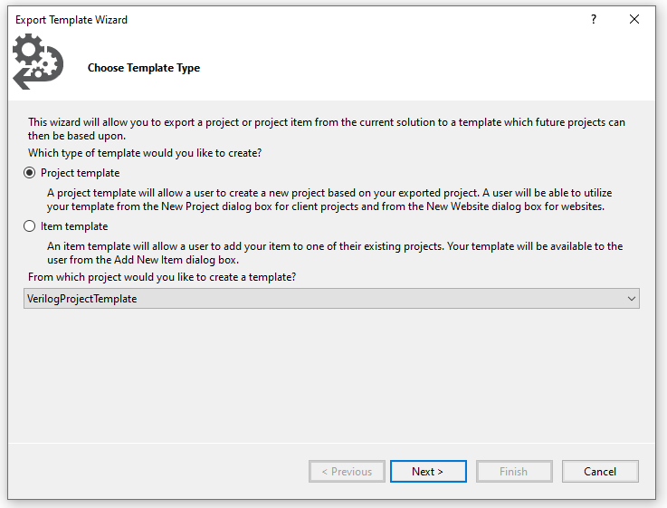

# Verilog Project Template for Visual Studio

The Verilog Project Template for Visual Studio assumes that the [Windows Subsystem For Linux](https://en.wikipedia.org/wiki/Windows_Subsystem_for_Linux) (aka "WSL") is
already installed, as well as several key components such as [verilator](https://en.wikipedia.org/wiki/Verilator), 
[yosys](http://www.clifford.at/yosys/), [nextpnr](https://github.com/YosysHQ/nextpnr) and the [ecppack](https://github.com/SymbiFlow/prjtrellis/blob/master/libtrellis/tools/ecppack.cpp)
utility in [Project Trellis](https://github.com/SymbiFlow/prjtrellis). 

To actually upload the synthesized bitstream onto the FPGA, the 
[fujprog](https://github.com/kost/fujprog/issues) is should be used.

One option is to install everything for the complete [ULX3S Toolchain](https://github.com/ulx3s/ulx3s-toolchain).
This is probably best if you want to keep up with the latest versions and have full control. Although tailored for the
ULX3S with ESP32 development, this toolchain is easily adapted to other FPGA devices with minimal changes.

A custom FPGA "build" is called from a DOS batch file in the [build](./build/) directory. There's a bit of logic there
that checks for which directory WSL needs to be used. Target Deploys are found in the `<Target Name="Build"  >` section
of the [ProjectTemplate.csproj](./ProjectTemplate.csproj) file. (yes, it is a bit wonky to have this be a C# app, if anyone
knows how to change that to something better, please submit a PR)

Once the batch file figures out which WSL directory to use, the Linux `make` is called using the local project [Makefile](./Makefile)


## Installing WSL

This template was developed on Ubuntu 18.04.4 LTS for WSL. See the [Microsoft Instructions](https://docs.microsoft.com/en-us/windows/wsl/install-win10)
Check the version with ` lsb_release -a`. If you need to update:

```
sudo apt-get upgrade
sudo apt dist-upgrade -y
sudo do-release-upgrade
```

## Installing Verilator:

```
sudo apt-get install verilator
```

## Installing yosys / nextpnr / ecppack

There are several options available to install the toolchain:

Recommended (but perhaps challenging): see each repo and follow the instructions there.

These individual scripts are also available:

* [verilator](https://github.com/ulx3s/ulx3s-toolchain/blob/master/install_verilator.sh)
* [yoysys](https://github.com/ulx3s/ulx3s-toolchain/blob/master/install_yosys.sh)
* [nextpnr](https://github.com/ulx3s/ulx3s-toolchain/blob/master/install_nextpnr.sh)
* [ecppack - Project Trellis](https://github.com/ulx3s/ulx3s-toolchain/blob/master/install_prjtrellis.sh)

Just fetch the repo and run each individual script:
```
export WORKSPACE=/mnt/s/workspace
export THIS_ULX3S_DEVICE=LFE5U-85F
export ULX3S_COM=/dev/ttyS8

sudo apt-get update
mkdir -p %WORKSPACE%

git clone https://github.com/ulx3s/ulx3s-toolchain.git
cd ulx3s-toolchain


## ensure all scripts are executable
chmod +x install_set_permissions.sh

./install_set_permissions.sh
./install_verilator.sh
./install_yosys.sh
./install_prjtrellis.sh
./install_icestorm.sh
./install_nextpnr.sh
```


Kost has prompiled binary [releases](https://github.com/alpin3/ulx3s/releases).

## Updating the Project Template

Although Visual Studio should (in theory) allow an included project to be an asset in the deployed VSIX install, this behaviour was not observed.

For now, from the main menu in the [AddedExtensionProjectTemplate/Verilog Project/Verilog Project.sln Solution](./Verilog Project.sln) click on `Project - Export Template`. Ensure the `VerilogProjectTemplate` is the project being exported! (this is typically not the default).



The only option is a read-only save to `C:\Users\%USERNAME%\Documents\Visual Studio 2019\My Exported Templates\VerilogProjectTemplate.zip`. 
Copy this file to the solution `ProjectTemplates` directory. See the [source.extension.vsixmanifest](../../source.extension.vsixmanifest) file.

For example, put the zip `C:\Users\gojimmypi\Documents\Visual Studio 2019\Templates\ProjectTemplates`

## Other Resources:

* [Output errors, warnings and messages from batch file in Visual Studio build event](https://stackoverflow.com/questions/29799149/output-errors-warnings-and-messages-from-batch-file-in-visual-studio-build-even)
* [Template Parameters](https://docs.microsoft.com/en-us/visualstudio/ide/template-parameters?view=vs-2019)
* [Get started with the Windows Subsystem for Linux](https://docs.microsoft.com/en-us/learn/modules/get-started-with-windows-subsystem-for-linux/)

* [How to: View, save, and configure build log files](https://docs.microsoft.com/en-us/visualstudio/ide/how-to-view-save-and-configure-build-log-files?view=vs-2019)
* [Walkthrough: Create an inline task](https://docs.microsoft.com/en-us/visualstudio/msbuild/walkthrough-creating-an-inline-task?view=vs-2019) for MSBuild
* [ProcessStartInfo.RedirectStandardOutput Property](https://docs.microsoft.com/en-us/dotnet/api/system.diagnostics.processstartinfo.redirectstandardoutput?view=netframework-4.8#System_Diagnostics_ProcessStartInfo_RedirectStandardOutput)
* [Target element (MSBuild)](https://docs.microsoft.com/en-us/visualstudio/msbuild/target-element-msbuild?view=vs-2019)
* [Task element of Target (MSBuild)](https://docs.microsoft.com/en-us/visualstudio/msbuild/task-element-msbuild?view=vs-2019)
* [Task base class](https://docs.microsoft.com/en-us/visualstudio/msbuild/task-base-class?view=vs-2019)
* [UsingTask element (MSBuild)](https://docs.microsoft.com/en-us/visualstudio/msbuild/usingtask-element-msbuild?view=vs-2019)
* [Exec task](https://docs.microsoft.com/en-gb/visualstudio/msbuild/exec-task?view=vs-2019) for MSBuid

* [Output element (MSBuild)](https://docs.microsoft.com/en-us/visualstudio/msbuild/output-element-msbuild?view=vs-2019)
* [StackOverflow: MSBuild exec task without blocking: ExecAsync](https://stackoverflow.com/questions/2387456/msbuild-exec-task-without-blocking)

* [StackOverflow: MSBuild AfterBuild messages not showing real-time](https://stackoverflow.com/questions/38125377/msbuild-afterbuild-messages-not-showing-real-time)
* [ToolTask.YieldDuringToolExecution Property](https://docs.microsoft.com/en-us/dotnet/api/microsoft.build.utilities.tooltask.yieldduringtoolexecution?view=netframework-4.8)

* [Get started with the Windows Subsystem for Linux](https://docs.microsoft.com/en-us/learn/modules/get-started-with-windows-subsystem-for-linux/)