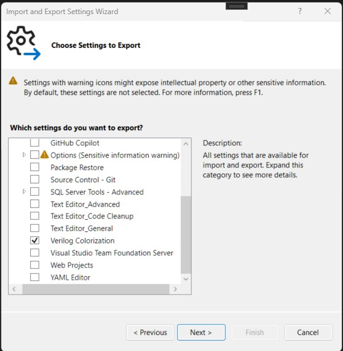

# Verilog Language Exchange Color Settings

The enclosed `default-dark-mode.vssettings` and `default-light-mode.vssettings` files 
can be imported to set the color settings for Verilog language in Visual Studio.
They are not used by default, so you need to import them manually.

## Export Settings

In Visual Studio:

Click `Tools` - `Import and Export Settings ...`

