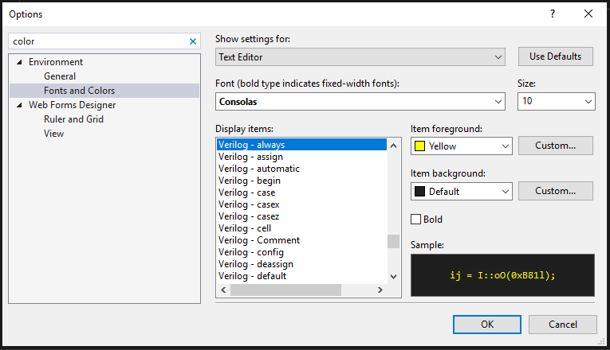
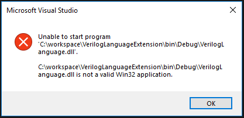
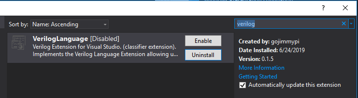

# Verilog Language Extension

This Visual Studio Extension adds syntax & keyword higlighting to Visual Studio versions 2015, 2017, and 2019. There is no notion of a "Verilog Project" or any other capabilities such as compiling or uploading to a device at this time.

On a Windows 10 machine to create FPGA binaries, consider using the [yoysys](https://github.com/YosysHQ/yosys)/[nextpnr](https://github.com/YosysHQ/nextpnr) toolchain. I have a [gist for the ULX3S](https://gist.github.com/gojimmypi/f96cd86b2b8595b4cf3be4baf493c5a7) as well as [one for the TinyFPGA](https://gist.github.com/gojimmypi/243fc3a6eead72ae3db8fd32f2567c96) in [WSL](https://gojimmypi.blogspot.com/2019/02/ulx3s-ujprog-on-windows-wsl-or-minggw.html) that may be useful in installing these along with all the respective dependencies.

## Installation - Visual Studio Market Place

https://marketplace.visualstudio.com/items?itemName=gojimmypi.gojimmypi-verilog-language-extension

## Installation - Manual install with source code 

Find the location of your `VSIXInstaller.exe`, typpically in `.\Common7\IDE\` of Developer Command Prompt. Shown is an example of VS2017 Enterprise:

```
c:
cd \workspace
git clone https://github.com/gojimmypi/VerilogLanguageExtension.git
cd VerilogLanguageExtension
msbuild VerilogLanguage.csproj
"C:\Program Files (x86)\Microsoft Visual Studio\2017\Enterprise\Common7\IDE\VSIXInstaller.exe"  C:\workspace\VerilogLanguageExtension\bin\Release\VerilogLanguage.vsix
```

## Installation - Prior Releases

See [releases](./releases/README.md) directory for prior versions.

## Removal

```
"C:\Program Files (x86)\Microsoft Visual Studio\2017\Enterprise\Common7\IDE\VSIXInstaller.exe" /uninstall:CF0DCF14-5B8F-4B42-8386-9D37BB99F98E
```


## Testing

Open the project and press `F5` to launch an experimental version of Visual Studio.


## Customization

Set your own preferred colors in Tools - Options - Fonts and Colors:



## Modifications

To make modifications, the [Visual Studio Extension Development Workload Toolset](https://visualstudio.microsoft.com/vs/support/selecting-workloads-visual-studio-2017/) needs to be installed.

### Version Change

Edit the version in two places: [source.extension.vsixmanifest](./source.extension.vsixmanifest) and [Properties - AssemblyInfo.cs](./Properties/AssemblyInfo.cs).

### Single word highlight

When clicking on a single word, Visual Studio highlights all the matching words. This higlight happens in [HighlightWordFormatDefinition](./Highlighting/HighlightWordFormatDefinition.cs).

See also the [EditorFormatDefinition Class](https://docs.microsoft.com/en-us/dotnet/api/microsoft.visualstudio.text.classification.editorformatdefinition?view=visualstudiosdk-2019)

### Verilog Toke Types

Add a `public enum VerilogTokenTypes` value (there can be more items listed here than actually implemented) in [VerilogTokenTypes.cs](VerilogTokenTypes.cs#L19): 
```
        Verilog_begin,
```

Add a declaration in `ClassificationType.cs`
```
        /// <summary>
        /// Defines the "Verilog_begin" classification type.
        /// </summary>
        [Export(typeof(ClassificationTypeDefinition))]
        [Name("begin")]
        internal static ClassificationTypeDefinition Verilog_begin = null;
```

Add a ClassificationFormat.cs

```
    [Export(typeof(EditorFormatDefinition))]
    [ClassificationType(ClassificationTypeNames = "begin")]
    [Name("begin")]
    //this should be visible to the end user
    [UserVisible(true)] // sets this editor format definition visible for the user (in Tools>Options>Environment>Fonts and Colors>Text Editor
    //set the priority to be after the default classifiers
    [Order(Before = Priority.Default)]
    internal sealed class Verilog_begin : ClassificationFormatDefinition
    {
        /// <summary>
        /// Defines the visual format for the "begin" classification type
        /// </summary>
        public Verilog_begin()
        {
            DisplayName = "begin"; //human readable version of the name
            ForegroundColor = Colors.BlueViolet;
        }
    }
```

add a VerilogTokenTagger in `VerilogTokenTag.cs`

```
            _VerilogTypes["begin"] = VerilogTokenTypes.Verilog_begin;
```

Add `internal VerilogClassifier` entry in `VerilogClassifier.cs`
```
            _VerilogTypes[VerilogTokenTypes.Verilog_begin] = typeService.GetClassificationType("begin");
```

Optional: add `List<Completion> completions = new List<Completion>()` item for `AugmentCompletionSession` in `CompletionSource.cs`:
```
new Completion("begin"),

```

Optional: add `AugmentQuickInfoSession` section in `VerilogQuickInfoSource.cs`:
```
                else if (curTag.Tag.type == VerilogTokenTypes.Verilog_begin)
                {
                    var tagSpan = curTag.Span.GetSpans(_buffer).First();
                    applicableToSpan = _buffer.CurrentSnapshot.CreateTrackingSpan(tagSpan, SpanTrackingMode.EdgeExclusive);
                    quickInfoContent.Add("Question Begin?");
                }
```

## Color Reference

From [Microsoft System.Windows.Media.Colors Class](https://docs.microsoft.com/en-us/dotnet/api/system.windows.media.colors?view=netframework-4.8)


## Troubleshooting

If this error is encountered in Visual Studio 2019 when attempting to F5/Debug:



Try opening the [project file](VerilogLanguage.csproj) rather than the [solution](./VerilogLanguageExtension.sln).

If the extension is installed, but syntax is not highlighted, ensure the file ends with ".v" and that the extension is _enabled_:




# Notes

From [VSIX Manifest Designer](https://docs.microsoft.com/en-us/visualstudio/extensibility/vsix-manifest-designer?view=vs-2019):

| Visual Studio Product | Version |
| --- | --- |
| Visual Studio 2019 | 16.0 |
| Visual Studio 2017 | 15.0 |
| Visual Studio 2015 | 14.0 |
| Visual Studio 2013 | 12.0 |

* [ – minimum version inclusive.

* ] – maximum version inclusive. 

* ( – minimum version exclusive. 

* ) – maximum version exclusive.

## Other Verilog Syntax Highlighters

* [V3S](https://marketplace.visualstudio.com/items?itemName=fmax.V3S-VHDLandVerilogforVisualStudio2015)  V3S - VHDL, Verilog, SystemVerilog for VS2015; Free Trial, $40 and up to purchase.

* [SystemVerilog - Language Support](https://marketplace.visualstudio.com/items?itemName=eirikpre.systemverilog) VS Code Language support for Verilog / SystemVerilog (not Visual Studio)

* [Verilog HDL/SystemVerilog](https://marketplace.visualstudio.com/items?itemName=mshr-h.VerilogHDL) Verilog HDL support for VS Code (not Visual Studio)
 
## Microsoft Resources

* [Inside the editor](https://docs.microsoft.com/en-us/visualstudio/extensibility/inside-the-editor?view=vs-2019#tags-and-classifiers)

* [System.Windows.Media.Colors Class](https://docs.microsoft.com/en-us/dotnet/api/system.windows.media.colors?view=netframework-4.8)

* [Visual Studio SDK](https://docs.microsoft.com/en-us/visualstudio/extensibility/visual-studio-sdk?view=vs-2019)

* [Visual Studio Extensibility (VSX)](http://www.visualstudioextensibility.com/samples/packages/) 

* [Visual Studio Extensibility: Creating Visual Studio VSIX package extension](https://social.technet.microsoft.com/wiki/contents/articles/37071.visual-studio-extensibility-creating-visual-studio-vsix-package-extension.aspx)

* [Implementing Syntax Coloring](https://docs.microsoft.com/en-us/visualstudio/extensibility/internals/implementing-syntax-coloring?view=vs-2019)

* [Walkthrough: Display matching braces](https://docs.microsoft.com/en-us/visualstudio/extensibility/walkthrough-displaying-matching-braces?view=vs-2019)

* [Colors and Styling for Visual Studio](https://docs.microsoft.com/en-us/visualstudio/extensibility/ux-guidelines/colors-and-styling-for-visual-studio?view=vs-2019)

* [EnvironmentColors Class](https://docs.microsoft.com/en-us/dotnet/api/microsoft.visualstudio.platformui.environmentcolors?view=visualstudiosdk-2017)

* [Walkthrough: Display matching braces](https://docs.microsoft.com/en-us/visualstudio/extensibility/walkthrough-displaying-matching-braces?view=vs-2019)

* [SnapshotSpan Structure](https://docs.microsoft.com/en-us/dotnet/api/microsoft.visualstudio.text.snapshotspan)

* [SnapshotPoint Structure](https://docs.microsoft.com/en-us/dotnet/api/microsoft.visualstudio.text.snapshotpoint)

* [Walkthrough: Publish a Visual Studio extension](https://docs.microsoft.com/en-us/visualstudio/extensibility/walkthrough-publishing-a-visual-studio-extension?view=vs-2019)

* [GitHub Microsoft/VSSDK-Extensibility-Samples](https://github.com/Microsoft/VSSDK-Extensibility-Samples) [ook!](https://github.com/Microsoft/VSSDK-Extensibility-Samples/tree/master/Ook_Language_Integration)


## Other Resources

* [CodeProject - Extending Visual Studio to Provide a Colorful Language Editor](https://www.codeproject.com/Articles/1245021/Extending-Visual-Studio-to-Provide-a-Colorful-Lang)

* [Michael's Coding Spot - Visual Studio 2017 Extension development tutorial](https://michaelscodingspot.com/visual-studio-2017-extension-development-tutorial-part-1/)

* [Xilinx - Verilog Reserved Words](https://www.xilinx.com/support/documentation/sw_manuals/xilinx11/ite_r_verilog_reserved_words.htm)

* [Xilinx - Verilog Compiler Directives](https://www.xilinx.com/support/documentation/sw_manuals/xilinx10/isehelp/ism_r_verlang_compiler_directives.htm)

* [madskristensen - Extensibility Tools for Visual Studio](https://github.com/madskristensen/ExtensibilityTools)

* [What is the yield keyword used for in C#?](https://stackoverflow.com/questions/39476/what-is-the-yield-keyword-used-for-in-c)


## FPGA Resources

* [asic-world](http://www.asic-world.com/verilog/) - Verilog

* [asic-world](http://www.asic-world.com/vhdl/index.html) - VHDL


## Interesting Examples

* [CodyDocs](https://github.com/michaelscodingspot/CodyDocs/blob/master/CodyDocs/Events/EventAggregator.cs) (see also Michael's Coding Spot, above)

* [Asm-Dude](https://github.com/HJLebbink/asm-dude)


## Change History:

* 2019-06-22  [v0.1.5]() square bracket and content colorization; detect light/dark theme; colorize non-synthesizable keywords; hover text; new extensions `.vh` and `.verilog`
* 2019-06-17  [v0.1.4](./releases/VerilogLanguage_v0.1.4.vsix) compiled in Visual Studio 2019 instead of 2017, needed to bump version as "updates" didn't seem to see the 4th segment version change
* 2019-06-16  v0.1.3 disable code in HighlightWordFormatDefinition to use Visual Studio default selected word higlighting.
* 2019-06-16  [v0.1.2](./releases/VerilogLanguage_v0.1.2.vsix) fixes some syntax delimiter highlighting issues in comments.
* 2019-04-23  [v0.1.1](./releases/VerilogLanguage_v0.1.1.vsix) support for VS2019, remove extraneous autocomplete
* 2019-04-21  v0.1   initial code release
