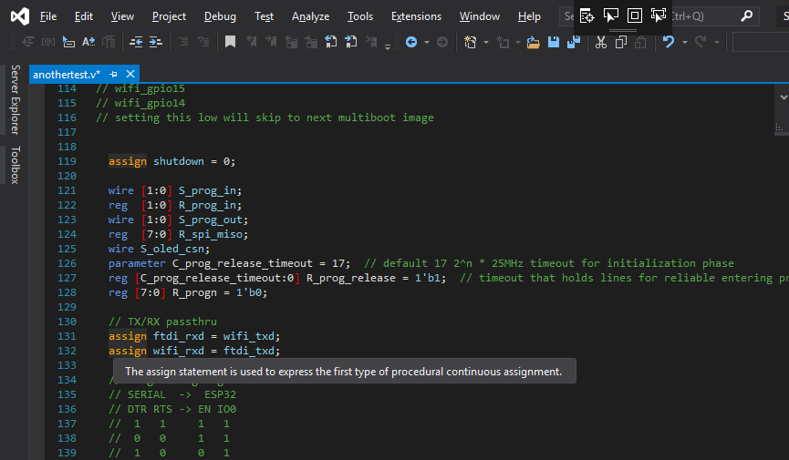
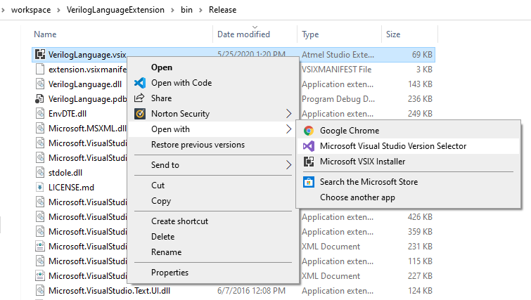
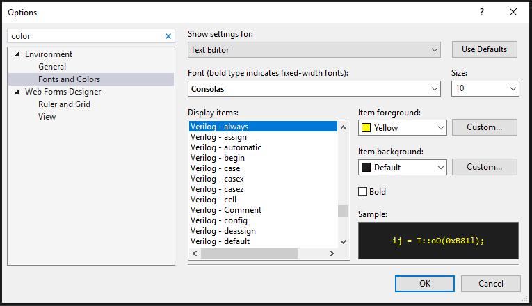
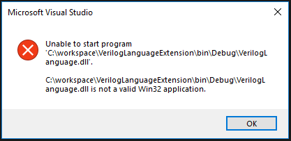
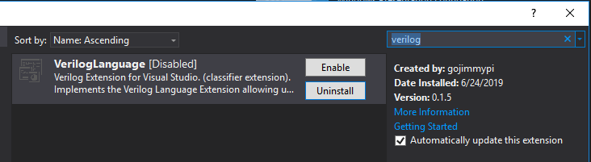
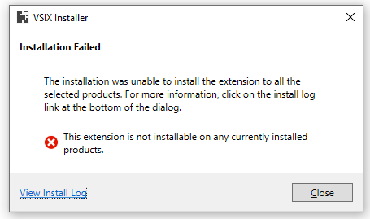
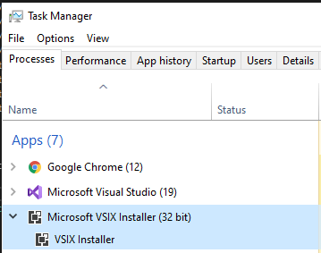
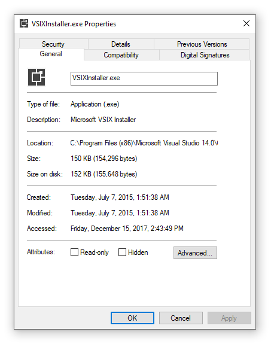
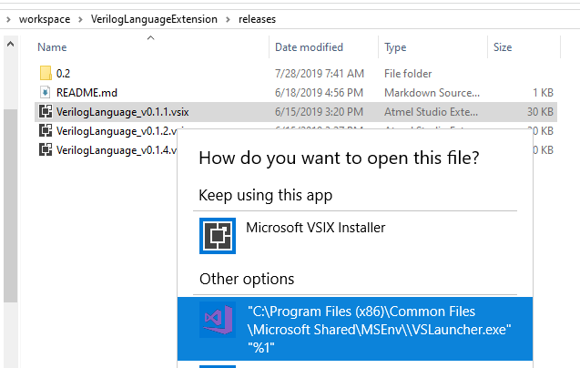

# Verilog Language Extension

Release v0.4.1.0

This Visual Studio Extension adds syntax and keyword highlighting to Visual Studio versions 2022, and 2026. 

There is no notion of a "Verilog Project" or any other capabilities such as compiling or uploading to a device at this time.



On a Windows 10/11 machine to create FPGA binaries, consider using the [yoysys](https://github.com/YosysHQ/yosys)/[nextpnr](https://github.com/YosysHQ/nextpnr) toolchain. I have a [gist for the ULX3S](https://gist.github.com/gojimmypi/f96cd86b2b8595b4cf3be4baf493c5a7) as well as [one for the TinyFPGA](https://gist.github.com/gojimmypi/243fc3a6eead72ae3db8fd32f2567c96) in [WSL](https://gojimmypi.blogspot.com/2019/02/ulx3s-ujprog-on-windows-wsl-or-minggw.html) that may be useful in installing these along with all the respective dependencies.


## Features

* Each keyword can be individually colorized. See `File - Options - Environment - Fonts and Colors`

* Line and block comments are colorized.

* Verilog keywords have hover text documentation.

* Variables have hover text to indicate declaration, or lack thereof. Module declaration is also noted as appropriate.

* As of version 0.2x there are different default colors depending on dark or light theme. See `bool IsDarkTheme()` in `ClassificationFormat.cs`

* Multi-colored brackets, depending on nested depth. See Fonts and Colors - Display Items `Verilog - Bracket Depth [n]`


## Version 0.4.0 Code Update Summary

Compared with v0.3.5.4, v0.4.0 is a major editor-quality and release-polish update. The most important changes are:

* Adds Visual Studio package/menu plumbing for a Snapshot Exporter command, enabling repeatable editor snapshot exports for regression testing.

* Adds local snapshot CI tooling under `tools/vle-ci`, with manifests, expectations, baseline snapshots, and wrapper scripts such as `ci-pass.ps1`, `ci-baseline.ps1`, and `ci-check.ps1`.

* Adds Verilog-specific outlining/folding for common language regions including modules, functions, tasks, case blocks, begin/end blocks, always/if/else blocks, and preprocessor conditionals.

* Adds `.svh` SystemVerilog header support.

* Adds colorization/classification support for static double-quoted strings, function names, macro references, conditional macro-controlled definitions, duplicate declarations, and additional SystemVerilog declaration keywords such as `bit`, `logic`, and `automatic`.

* Improves variable and hover handling by caching parse data per file and snapshot version, avoiding stale cross-file or stale-snapshot hover results.

* Improves function/task local-scope handling so local declarations are resolved before module/global symbols, and duplicate names in different functions/tasks are no longer treated as the same declaration.

* Improves duplicate declaration detection so it is based on the same immutable snapshot used by the parse pass, reducing false or stale duplicate markers during edits.

* Improves edit refresh behavior by invalidating changed spans immediately, then refreshing again when threaded reparsing completes. This helps avoid stale highlighting after paste, delete, or multi-change edits.

* Improves performance and lifecycle behavior by making token taggers/classifiers singleton-per-buffer, preventing repeated tagger/aggregator instances and duplicate buffer-change subscriptions.

* Adds explicit disposal paths for the token tagger's buffer event subscription and reparse timer, and bounds the reparse-completion watcher so a stuck parse state cannot keep a timer alive indefinitely.

* Updates build and packaging metadata for v0.4.0.0, including VS package assets, VS2022/VS2026-oriented SDK references, Release VSIX debug-symbol exclusion, and manifest links that use the `main` branch.

* Cleans up older sample/reference code and replaces the generic sample outlining implementation with Verilog-specific outlining code.


## File Extensions Supported:

These file extensions should activate this extension:

* `.sv`
* `.svh`
* `.v`
* `.verilog`
* `.vh`

See the exported `FileExtensionToContentTypeDefinition` entries in [VerilogClassifier](./Classification/VerilogClassifier.cs) to add more file types.


## Installation 

The easiest way to install the release version is to use the Visual Studio `Extensions - Manage Extensions` dialog. 
Type the search word `FPGA` or `VerilogLanguage` to find the extension in the Online downloads.

Alternatively:

### Installation - Visual Studio Market Place

The VSIX file can also be downloaded manually from the Visual Studio Marketplace web site:

https://marketplace.visualstudio.com/items?itemName=gojimmypi.gojimmypi-verilog-language-extension


### Installation - Manual install with source code 

_Note_: previously it was recommended to use `VSIXInstaller.exe`, typically in `.\Common7\IDE\`; *DON'T DO THIS*, Instead use
the "Microsoft Visual Studio Version Selector": `VSLauncher.exe`


```
c:
cd \workspace
git clone https://github.com/gojimmypi/VerilogLanguageExtension.git
cd VerilogLanguageExtension
msbuild VerilogLanguage.csproj
"%ProgramFiles% (x86)\Common Files\Microsoft Shared\MSEnv\VSLauncher.exe" C:\workspace\VerilogLanguageExtension\bin\Release\VerilogLanguage.vsix
```

### Installation - Manual install of VSIX file

As noted above, use the "Microsoft Visual Studio Version Selector" and NOT the "VSIX Installer" (counter-intuitive, I know)




### Installation - Prior Releases

See [releases](./releases/README.md) directory for prior versions.


## Removal

Use either Extensions - Manage Extensions, or this command-line:

```
"C:\Program Files (x86)\Microsoft Visual Studio\2017\Enterprise\Common7\IDE\VSIXInstaller.exe" /uninstall:CF0DCF14-5B8F-4B42-8386-9D37BB99F98E
```


## Testing

Open the project and press `F5` to launch an experimental version of Visual Studio.

For v0.4.0 development, the repository also includes local snapshot regression tooling. The short path is:

```powershell
.\ci-pass.ps1
.\ci-baseline.ps1
.\ci-check.ps1
```

The snapshot tools export classification, token, hover, and parser state from the Visual Studio Experimental Instance and compare the results against checked-in baselines. See `tools/vle-ci/README.md` for details.


## Customization

Set your own preferred colors in Tools - Options - Fonts and Colors:



## Modifications

To make modifications, the [Visual Studio Extension Development Workload Toolset](https://visualstudio.microsoft.com/vs/support/selecting-workloads-visual-studio-2017/) needs to be installed.

It is usually best to completely remove the existing extension when doing development and increment the version number. 
I have no hard evidence for this other than experience with odd, unexplained errors, often involving `VsTextBoxStyleKey` 
and not in this extension code:

```
System.Windows.Markup.XamlParseException
  HResult=0x80131501
  Message=Provide value on 'System.Windows.Markup.StaticResourceHolder' threw an exception.
  Source=PresentationFramework
  StackTrace:
   at System.Windows.Markup.WpfXamlLoader.Load(XamlReader xamlReader, IXamlObjectWriterFactory writerFactory, Boolean skipJournaledProperties, Object rootObject, XamlObjectWriterSettings settings, Uri baseUri)

Inner Exception 1:
Exception: Cannot find resource named 'VsTextBoxStyleKey'. Resource names are case sensitive.
```

This error appears at experimental instance launch time, well before even loading a Verilog `.v` file.

Further, this problem appears to be specific to Visual Studio 2019 and only appears when debugging an extension a *second* time. :/
Exiting Visual Studio and debugging the project fresh does not cause this error in the experimental instance. 
This appeared to be problematic in both `debug` and `release` modes.
The error occured on October 6 for Visual Studio 16.2.0 updated on July 28, 2019 (all recent Windows updates applied).
The error was not previously observed when developing and debugging this solution. 


### Version Change

Edit the version in [source.extension.vsixmanifest](./source.extension.vsixmanifest) and [Properties - AssemblyInfo.cs](./Properties/AssemblyInfo.cs). v0.4.0 also sets assembly file and informational versions.


### Single word highlight

When clicking on a single word, Visual Studio highlights all the matching words. This higlight happens in [HighlightWordFormatDefinition](./Highlighting/HighlightWordFormatDefinition.cs).

See also the [EditorFormatDefinition Class](https://docs.microsoft.com/en-us/dotnet/api/microsoft.visualstudio.text.classification.editorformatdefinition?view=visualstudiosdk-2019)


### Verilog Token Types

Add a `public enum VerilogTokenTypes` value (there can be more items listed here than actually implemented) in [VerilogTokenTypes.cs](VerilogTokenTypes.cs#L19): 
```
        Verilog_begin,
```

Add a declaration in `ClassificationType.cs`
```
        /// <summary>
        /// Defines the "Verilog_begin" classification type.
        /// </summary>
        [Export(typeof(ClassificationTypeDefinition))]
        [Name("begin")]
        internal static ClassificationTypeDefinition Verilog_begin = null;
```

Add a ClassificationFormat.cs

```
    [Export(typeof(EditorFormatDefinition))]
    [ClassificationType(ClassificationTypeNames = "begin")]
    [Name("begin")]
    //this should be visible to the end user
    [UserVisible(true)] // sets this editor format definition visible for the user (in Tools>Options>Environment>Fonts and Colors>Text Editor
    //set the priority to be after the default classifiers
    [Order(Before = Priority.Default)]
    internal sealed class Verilog_begin : ClassificationFormatDefinition
    {
        /// <summary>
        /// Defines the visual format for the "begin" classification type
        /// </summary>
        public Verilog_begin()
        {
            DisplayName = "begin"; //human readable version of the name
            ForegroundColor = Colors.BlueViolet;
        }
    }
```

add a VerilogTokenTagger in `VerilogGlobals.cs`

```
            ["begin"] = VerilogTokenTypes.Verilog_begin;
```

Add `internal VerilogClassifier` entry in `VerilogClassifier.cs`
```
            _VerilogTypes[VerilogTokenTypes.Verilog_begin] = typeService.GetClassificationType("begin");
```

Optional: add `List<Completion> completions = new List<Completion>()` item for `AugmentCompletionSession` in `CompletionSource.cs`:
```
new Completion("begin"),

```

Optional: add `AugmentQuickInfoSession` section in `VerilogQuickInfoSource.cs`:
```
                else if (curTag.Tag.type == VerilogTokenTypes.Verilog_begin)
                {
                    var tagSpan = curTag.Span.GetSpans(_buffer).First();
                    applicableToSpan = _buffer.CurrentSnapshot.CreateTrackingSpan(tagSpan, SpanTrackingMode.EdgeExclusive);
                    quickInfoContent.Add("Question Begin?");
                }
```


### Verilog Variables

Similar to keywords, declared variables of type `input`, `output`, `inout`, `wire`, `reg`, and `parameter` are colorized when the definitions are found.
Otherwise they will appear in plain text white. See `BuildHoverItems(string s)` for the state machine logic that parses the data looking
for variables. Note that the text sent is assumed to be already split and de-commented.  See `LineParse(string theLine, int theLineNumber)`.


## Color Reference

From [Microsoft System.Windows.Media.Colors Class](https://docs.microsoft.com/en-us/dotnet/api/system.windows.media.colors?view=netframework-4.8)


## Troubleshooting

Although the executable extension should work for version of Visual Studio as far back as 2015, 
this solution was developed in Visual Studio 2019. Some features may be missing in prior versions, 
so it is recommended that any code changes be made in Visual Studio 2019.

### Unable to start program

If this error is encountered in Visual Studio 2019 when attempting to F5/Debug:



Try opening the [project file](VerilogLanguage.csproj) rather than the [solution](./VerilogLanguageExtension.sln).

### No visible syntax highlighting

If the extension is installed, but syntax is not highlighted, ensure the file ends with ".v" and that the extension is _enabled_:



### Unable to install downloaded VSIX file

If you see an error regarding "This extension is not installable on any currently installed products" like this:



And the install log looks like this:

```
7/28/2019 8:52:20 AM - Microsoft VSIX Installer
7/28/2019 8:52:20 AM - -------------------------------------------
7/28/2019 8:52:20 AM - Initializing Install...
7/28/2019 8:52:20 AM - Extension Details...
7/28/2019 8:52:20 AM - 	Identifier      : CF0DCF14-5B8F-4B42-8386-9D37BB99F98E
7/28/2019 8:52:20 AM - 	Name            : VerilogLanguage
7/28/2019 8:52:20 AM - 	Author          : gojimmypi
7/28/2019 8:52:20 AM - 	Version         : 0.1.4
7/28/2019 8:52:20 AM - 	Description     : Verilog Keyword highlighting for Visual Studio. Sample classifier extension to the Visual Studio Editor. Implements the Verilog Language Extension.
7/28/2019 8:52:20 AM - 	Locale          : en-US
7/28/2019 8:52:20 AM - 	MoreInfoURL     : https://github.com/gojimmypi/VerilogLanguageExtension
7/28/2019 8:52:20 AM - 	InstalledByMSI  : False
7/28/2019 8:52:20 AM - 	SupportedFrameworkVersionRange : [4.5]
7/28/2019 8:52:20 AM - 
7/28/2019 8:52:20 AM - 	Supported Products : 
7/28/2019 8:52:20 AM - 		Microsoft.VisualStudio.Community
7/28/2019 8:52:20 AM - 			Version : [14.0,17.0)
7/28/2019 8:52:20 AM - 
7/28/2019 8:52:20 AM - 	References      : 
7/28/2019 8:52:20 AM - 
7/28/2019 8:52:20 AM - Searching for applicable products...
7/28/2019 8:52:20 AM - Found installed product - Global Location
7/28/2019 8:52:20 AM - Found installed product - AtmelStudio
7/28/2019 8:52:20 AM - Found installed product - ssms
7/28/2019 8:52:20 AM - VSIXInstaller.NoApplicableSKUsException: This extension is not installable on any currently installed products.
   at VSIXInstaller.App.InitializeInstall(Boolean isRepairSupported)
   at VSIXInstaller.App.InitializeInstall()
   at System.Threading.Tasks.Task.InnerInvoke()
   at System.Threading.Tasks.Task.Execute()

```

Notice how it appears *no* versions of Visual Studio are installed. Check the process that is running:



Right click and select `Properties` or `Open File Location`. If it openes to something _older_ than
`Microsoft Visual Studio 15.0` (VS 2017) or `Microsoft Visual Studio 16.0` (VS 2019). This VSIX extension
must be opened with the Visual Studio 2017 or 2019 installer.

This behaviour was observed after a Windows update, where Windows chose to open VSIX files with the installer in:

`C:\Program Files (x86)\Microsoft Visual Studio 14.0\Common7\IDE`

As shown here:



If this is the case, try right-clicking on the VSIX installer file and select `Open With...` and then `Choose another app`.
Find the specfic installer directory desired, or this `VSLauncher.exe` default also seems to work:




## Notes

From [VSIX Manifest Designer](https://docs.microsoft.com/en-us/visualstudio/extensibility/vsix-manifest-designer?view=vs-2019):

| Visual Studio Product | Version |
| --- | --- |
| Visual Studio 2019 | 16.0 |
| Visual Studio 2017 | 15.0 |
| Visual Studio 2015 | 14.0 |
| Visual Studio 2013 | 12.0 |

* [ - minimum version inclusive.

* ] - maximum version inclusive. 

* ( - minimum version exclusive. 

* ) - maximum version exclusive.

## Limitations / TODO

* Include files are not searched

* No ability to program devices

* No linting / syntax validation

* No ability to import / export color settings

## Other Verilog Syntax Highlighters

* [V3S](https://marketplace.visualstudio.com/items?itemName=fmax.V3S-VHDLandVerilogforVisualStudio2015)  V3S - VHDL, Verilog, SystemVerilog for VS2015; Free time-limited trial, $40 and up to purchase.

* [SystemVerilog - Language Support](https://marketplace.visualstudio.com/items?itemName=eirikpre.systemverilog) VS Code Language support for Verilog / SystemVerilog (not Visual Studio)

* [Verilog HDL/SystemVerilog](https://marketplace.visualstudio.com/items?itemName=mshr-h.VerilogHDL) Verilog HDL support for VS Code (not Visual Studio)
 
## Microsoft Resources

* [Inside the editor](https://docs.microsoft.com/en-us/visualstudio/extensibility/inside-the-editor?view=vs-2019#tags-and-classifiers)

* [System.Windows.Media.Colors Class](https://docs.microsoft.com/en-us/dotnet/api/system.windows.media.colors?view=netframework-4.8)

* [Visual Studio SDK](https://docs.microsoft.com/en-us/visualstudio/extensibility/visual-studio-sdk?view=vs-2019)

* [Visual Studio Extensibility (VSX)](http://www.visualstudioextensibility.com/samples/packages/) 

* [Visual Studio Extensibility: Creating Visual Studio VSIX package extension](https://social.technet.microsoft.com/wiki/contents/articles/37071.visual-studio-extensibility-creating-visual-studio-vsix-package-extension.aspx)

* [Implementing Syntax Coloring](https://docs.microsoft.com/en-us/visualstudio/extensibility/internals/implementing-syntax-coloring?view=vs-2019)

* [Walkthrough: Display matching braces](https://docs.microsoft.com/en-us/visualstudio/extensibility/walkthrough-displaying-matching-braces?view=vs-2019)

* [Colors and Styling for Visual Studio](https://docs.microsoft.com/en-us/visualstudio/extensibility/ux-guidelines/colors-and-styling-for-visual-studio?view=vs-2019)

* [EnvironmentColors Class](https://docs.microsoft.com/en-us/dotnet/api/microsoft.visualstudio.platformui.environmentcolors?view=visualstudiosdk-2017)

* [Walkthrough: Display matching braces](https://docs.microsoft.com/en-us/visualstudio/extensibility/walkthrough-displaying-matching-braces?view=vs-2019)

* [SnapshotSpan Structure](https://docs.microsoft.com/en-us/dotnet/api/microsoft.visualstudio.text.snapshotspan)

* [SnapshotPoint Structure](https://docs.microsoft.com/en-us/dotnet/api/microsoft.visualstudio.text.snapshotpoint)

* [Walkthrough: Publish a Visual Studio extension](https://docs.microsoft.com/en-us/visualstudio/extensibility/walkthrough-publishing-a-visual-studio-extension?view=vs-2019)

* [GitHub Microsoft/VSSDK-Extensibility-Samples](https://github.com/Microsoft/VSSDK-Extensibility-Samples) [ook!](https://github.com/Microsoft/VSSDK-Extensibility-Samples/tree/master/Ook_Language_Integration)

* [ITagger<T> Interface](https://docs.microsoft.com/en-us/dotnet/api/microsoft.visualstudio.text.tagging.itagger-1?view=visualstudiosdk-2017)

* [ITextViewLine Interface](https://docs.microsoft.com/en-us/dotnet/api/microsoft.visualstudio.text.formatting.itextviewline?view=visualstudiosdk-2017) - important for positioning

## Other Resources

* [CodeProject - Extending Visual Studio to Provide a Colorful Language Editor](https://www.codeproject.com/Articles/1245021/Extending-Visual-Studio-to-Provide-a-Colorful-Lang)

* [Michael's Coding Spot - Visual Studio 2017 Extension development tutorial](https://michaelscodingspot.com/visual-studio-2017-extension-development-tutorial-part-1/)

* [Xilinx - Verilog Reserved Words](https://www.xilinx.com/support/documentation/sw_manuals/xilinx11/ite_r_verilog_reserved_words.htm)

* [Xilinx - Verilog Compiler Directives](https://www.xilinx.com/support/documentation/sw_manuals/xilinx10/isehelp/ism_r_verlang_compiler_directives.htm)

* [madskristensen - Extensibility Tools for Visual Studio](https://github.com/madskristensen/ExtensibilityTools)

* [What is the yield keyword used for in C#?](https://stackoverflow.com/questions/39476/what-is-the-yield-keyword-used-for-in-c)


## FPGA Resources

* [asic-world](http://www.asic-world.com/verilog/) - Verilog

* [asic-world](http://www.asic-world.com/vhdl/index.html) - VHDL


## Interesting Examples

* [CodyDocs](https://github.com/michaelscodingspot/CodyDocs/blob/master/CodyDocs/Events/EventAggregator.cs) (see also Michael's Coding Spot, above)

* [Asm-Dude](https://github.com/HJLebbink/asm-dude)

# Build Output

* [stackoverflow: Echos from Post-Build events are only shown after build is complete](https://stackoverflow.com/questions/42854179/echos-from-post-build-events-are-only-shown-after-build-is-complete)
* [.net Process.WaitForExit inconsistent behavior re: process tree?](https://www.gamedev.net/forums/topic/488409-processwaitforexit-inconsistent-behavior-re-process-tree/)
* [Configuring Message Logging](https://docs.microsoft.com/en-us/dotnet/framework/wcf/diagnostics/configuring-message-logging)

## See also

* https://michaelscodingspot.com/vsix-identify-mouse-hover-location-in-the-editor/

* http://linq101.nilzorblog.com/linq101-lambda.php

* https://github.com/microsoft/vs-editor-api

* [Task Parallel Library (TPL)](https://docs.microsoft.com/en-us/dotnet/standard/parallel-programming/task-parallel-library-tpl)

* [public static SnapshotPoint? GetCaretPoint]( https://github.com/dotnet/roslyn/blob/3aae0158101ba007b856f2f5b3cf1110d2e52319/src/EditorFeatures/Core/Shared/Extensions/ITextViewExtensions.cs#L31)

* [ITextViewLine Interface](https://docs.microsoft.com/en-us/dotnet/api/microsoft.visualstudio.text.formatting.itextviewline?view=visualstudiosdk-2019)

* [ITextView.DisplayTextLineContainingBufferPosition Method](https://docs.microsoft.com/en-us/dotnet/api/microsoft.visualstudio.text.editor.itextview.displaytextlinecontainingbufferposition?f1url=https%3A%2F%2Fmsdn.microsoft.com%2Fquery%2Fdev15.query%3FappId%3DDev15IDEF1%26l%3DEN-US%26k%3Dk(Microsoft.VisualStudio.Text.Editor.ITextView.DisplayTextLineContainingBufferPosition);k(TargetFrameworkMoniker-.NETFramework,Version%3Dv4.5);k(DevLang-csharp)%26rd%3Dtrue&view=visualstudiosdk-2019)

* [yield (C# Reference](https://docs.microsoft.com/en-us/dotnet/csharp/language-reference/keywords/yield?f1url=https%3A%2F%2Fmsdn.microsoft.com%2Fquery%2Fdev15.query%3FappId%3DDev15IDEF1%26l%3DEN-US%26k%3Dk(yield_CSharpKeyword)%3Bk(TargetFrameworkMoniker-.NETFramework%2CVersion%3Dv4.5)%3Bk(DevLang-csharp)%26rd%3Dtrue)

* [TextContentChangedEventArgs Class](https://docs.microsoft.com/en-us/dotnet/api/microsoft.visualstudio.text.textcontentchangedeventargs?f1url=https%3A%2F%2Fmsdn.microsoft.com%2Fquery%2Fdev15.query%3FappId%3DDev15IDEF1%26l%3DEN-US%26k%3Dk(Microsoft.VisualStudio.Text.TextContentChangedEventArgs)%3Bk(TargetFrameworkMoniker-.NETFramework%2CVersion%3Dv4.5)%3Bk(DevLang-csharp)%26rd%3Dtrue&view=visualstudiosdk-2019#properties)

* [ITextBuffer Interface](https://docs.microsoft.com/en-us/dotnet/api/microsoft.visualstudio.text.itextbuffer?f1url=https%3A%2F%2Fmsdn.microsoft.com%2Fquery%2Fdev15.query%3FappId%3DDev15IDEF1%26l%3DEN-US%26k%3Dk(Microsoft.VisualStudio.Text.ITextBuffer)%3Bk(TargetFrameworkMoniker-.NETFramework%2CVersion%3Dv4.5)%3Bk(DevLang-csharp)%26rd%3Dtrue&view=visualstudiosdk-2019#methods)

* [ViewRelativePosition Enum](https://docs.microsoft.com/en-us/dotnet/api/microsoft.visualstudio.text.editor.viewrelativeposition?view=visualstudiosdk-2019)

* [ITextCaret.Position Property](https://docs.microsoft.com/en-us/dotnet/api/microsoft.visualstudio.text.editor.itextcaret.position?f1url=https%3A%2F%2Fmsdn.microsoft.com%2Fquery%2Fdev15.query%3FappId%3DDev15IDEF1%26l%3DEN-US%26k%3Dk(Microsoft.VisualStudio.Text.Editor.ITextCaret.Position);k(TargetFrameworkMoniker-.NETFramework,Version%3Dv4.5);k(DevLang-csharp)%26rd%3Dtrue&view=visualstudiosdk-2019)

* [Inside the editor](https://docs.microsoft.com/en-us/visualstudio/extensibility/inside-the-editor?view=vs-2019#the-text-view)

* [How to: Distribute code snippets](https://docs.microsoft.com/en-us/visualstudio/ide/how-to-distribute-code-snippets?view=vs-2019)

## Change History:

* 2026-06-25  v0.4.0.0 major editor-quality and release-polish update: VS2022/VS2026 package updates, `.svh` support, Verilog-specific outlining, static string/function/macro colorization, function/task local-scope fixes, stale-parse and duplicate-detection fixes, singleton-per-buffer tagger/classifier lifecycle improvements, Snapshot Exporter, and local snapshot CI tooling.
* 2019-06-22  [v0.1.5]() square bracket and content colorization; detect light/dark theme; colorize non-synthesizable keywords; hover text; new extensions `.vh` and `.verilog`
* 2019-06-17  [v0.1.4](./releases/VerilogLanguage_v0.1.4.vsix) compiled in Visual Studio 2019 instead of 2017, needed to bump version as "updates" didn't seem to see the 4th segment version change
* 2019-06-16  v0.1.3 disable code in HighlightWordFormatDefinition to use Visual Studio default selected word higlighting.
* 2019-06-16  [v0.1.2](./releases/VerilogLanguage_v0.1.2.vsix) fixes some syntax delimiter highlighting issues in comments.
* 2019-04-23  [v0.1.1](./releases/VerilogLanguage_v0.1.1.vsix) support for VS2019, remove extraneous autocomplete
* 2019-04-21  v0.1   initial code release

## How can I help?

If you enjoy using the extension, please give it a rating on the [Visual Studio Marketplace](https://marketplace.visualstudio.com/items?itemName=gojimmypi.gojimmypi-verilog-language-extension). It only takes a few seconds but makes a huge difference!

Found a bug or have a feature idea? Head over to the [GitHub repo](https://github.com/gojimmypi/VerilogLanguageExtension) to open an issue if one doesn't already exist.

Pull requests are enthusiastically welcomed! As this is a personal passion project maintained in my spare time, I can't always address every issue promptly. Your contributions help keep this extension vibrant and reliable for everyone.

If you find this extension saves you time or improves your workflow, please consider sponsoring me on GitHub. Even a small donation helps ensure continued development and support. Your sponsorship directly enables me to dedicate more time to this and other free extensions for the community. Thank you for your support!
