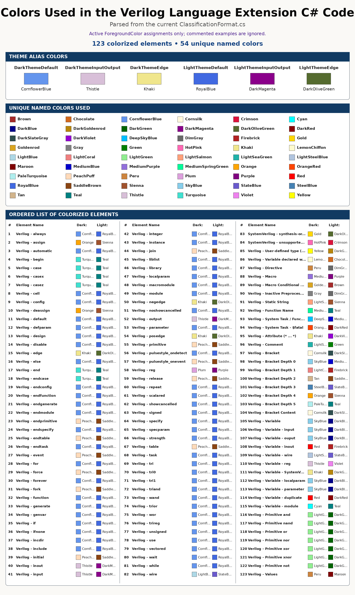

Customization
=============

VLE uses Visual Studio editor classifications, so most appearance changes are
made through the standard Visual Studio UI rather than an extension-specific
settings dialog.

Fonts and Colors
----------------

Open:

**Tools -> Options -> Environment -> Fonts and Colors**

Look for display items beginning with ``Verilog`` and ``SystemVerilog``.
Depending on the installed VLE version, entries can include keywords,
comments, variables, duplicate declarations, SystemVerilog data types,
attributes, system tasks/functions, strings, and bracket-depth levels.

Light and dark themes
---------------------

VLE supplies theme-aware defaults. If a color that looked good in one theme is
hard to read in another, override that display item in Fonts and Colors.
Visual Studio stores the user's final choice.

Color settings files
--------------------

The repository contains example settings under ``ColorSettings`` including:

* ``default-dark-mode.vssettings``
* ``default-light-mode.vssettings``

The same directory contains examples showing Visual Studio's settings import
and export UI. Treat these files as profiles that can be reviewed and imported,
not as a requirement for normal VLE operation.

Supported file extensions
-------------------------

The content-type mappings are declared in
``Classification/VerilogClassifier.cs``. To add another file extension in a
development build, add another exported
``FileExtensionToContentTypeDefinition`` associated with the ``verilog``
content type and validate that all MEF editor components attach as expected.

Preprocessor presentation opt-out
---------------------------------

The current preprocessor evaluator recognizes file-level markers that request
showing macro-controlled source rather than suppressing inactive-code
highlighting behavior:

.. code-block:: verilog

   // VLE: SHOW_INACTIVE_CODE

   (* NO_INACTIVE_MACRO_CODE *)

   `define VLE_SHOW_INACTIVE_CODE

These markers are VLE editor conventions. Review their effect in the editor
before committing them to synthesizable source shared with other tools.
