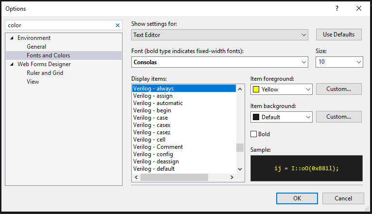

Features
========

VLE is built around the Visual Studio editor APIs. Features are intentionally
editor-oriented: they help inspect and navigate HDL without pretending to be a
simulator or synthesis tool.

Syntax classification and colorization
--------------------------------------

The classifier and token tagger recognize Verilog and selected SystemVerilog
constructs and publish Visual Studio classification tags. Examples include:

* Verilog keywords and compiler directives.
* Line comments and block comments.
* Static double-quoted strings.
* Module, function, and task names.
* Variables and declarations.
* Duplicate declarations.
* Macros and macro references.
* Verilog/SystemVerilog attributes written as ``(* ... *)``.
* Built-in ``$`` system tasks and functions.
* SystemVerilog-only keywords and data types.
* Resolved ``typedef`` aliases and variables declared using those aliases.

Colors are exposed through Visual Studio's normal **Fonts and Colors** UI, so
users can override the defaults.

Theme-aware defaults
--------------------

VLE supplies different default presentation choices for light and dark themes.
The final appearance is still controlled by Visual Studio and the user's Fonts
and Colors settings.

QuickInfo hover text
--------------------

Hover support can describe:

* Verilog keywords.
* Selected SystemVerilog keywords.
* Built-in system tasks and functions such as ``$display`` and ``$fopen``.
* Module and variable declarations.
* Function- and task-local declarations.
* Macro definitions.
* Symbols for which VLE can resolve declaration information.

QuickInfo uses parse information associated with the current file and text
snapshot so that hover information does not intentionally fall back to stale
parse data from an older editor snapshot.

Symbol navigation
-----------------

The code-window context menu exposes VLE navigation commands for Verilog
content:

* **Go To Definition**
* **Peek Definition**
* **Find All References**

The resolver uses the parser's symbol information and local-scope information.
Navigation is editor assistance, not a full elaborated design database, so
results depend on what VLE currently parses and resolves.

Outlining and folding
---------------------

VLE can create collapsible regions for common HDL structures, including:

* ``module`` / ``endmodule``
* ``function`` / ``endfunction``
* ``task`` / ``endtask``
* ``case`` / ``endcase``
* ``begin`` / ``end``
* ``always`` blocks
* ``if`` / ``else`` blocks when a matching ``begin`` block is present
* ``ifdef`` / ``ifndef`` conditional regions

The outlining parser is intentionally lightweight. Its job is to identify
editor regions, not to implement the complete Verilog grammar.

Nested bracket highlighting
---------------------------

Matching brackets can be classified by nesting depth. The corresponding
``Verilog - Bracket Depth`` entries can be customized in Fonts and Colors.

Preprocessor-aware inactive code
--------------------------------

The preprocessor evaluator tracks source-order macro state for highlighting.
It understands conditional directives and can process included source files in
textual order so macro definitions in an earlier include can affect later
conditional branches.

The evaluator has a maximum include depth of 64 and tracks include dependencies
so the editor can re-evaluate highlighting when an included file changes.

For files where inactive-code presentation is undesirable, the current source
recognizes these opt-out markers:

.. code-block:: verilog

   // VLE: SHOW_INACTIVE_CODE

   (* NO_INACTIVE_MACRO_CODE *)

   `define VLE_SHOW_INACTIVE_CODE

The exact presentation of active/inactive text is controlled by the token
classifier and theme settings.

SystemVerilog guidance classifications
--------------------------------------

VLE includes classifications that distinguish selected SystemVerilog syntax
using synthesis-oriented guidance. These classifications are editor guidance,
not a guarantee that a particular synthesis tool or version accepts the
construct in every context.

Snapshot exporter
-----------------

A **Tools -> Snapshot Export** command serializes editor state to JSON for
regression testing. The snapshot can include:

* Source identity and relative path.
* Snapshot length and version.
* SHA-256 of the current editor text.
* Parser tokens.
* Classification spans.
* VLE token tags.
* Parsed symbols.
* Export warnings or errors.

This feature primarily supports VLE development and CI rather than normal HDL
design work.

Project template
----------------

The VSIX packages a Visual Studio project template under
``ProjectTemplates/CSharp/1033/VerilogProject.zip``. The source-of-truth files
for that template live in ``AddedExtensionProjectTemplates/VerilogProject``.
The template is an optional starting point; ordinary existing ``.v`` and
``.sv`` files do not need to be placed in a VLE-specific project.

Intentional non-features
------------------------

VLE does not itself:

* Compile Verilog or SystemVerilog.
* Run a simulation.
* Synthesize a design.
* Run place-and-route.
* Generate an FPGA bitstream.
* Program an FPGA or ASIC device.

Those operations belong to external tools such as simulators, Yosys,
nextpnr, vendor toolchains, or board programmers.
