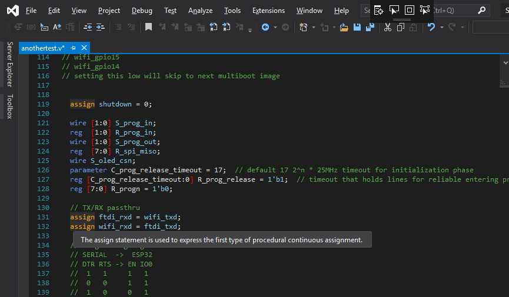

Verilog Language Extension
==========================

**Verilog Language Extension (VLE)** adds Verilog and SystemVerilog editor
support to Microsoft Visual Studio. It focuses on making HDL source easier to
read, navigate, inspect, and test while staying inside the Visual Studio editor.

VLE provides syntax classification, customizable colors, QuickInfo hover text,
symbol-aware navigation, outlining, nested-bracket highlighting, preprocessor
awareness, and developer snapshot tooling. The current VSIX package targets
Visual Studio 2022 and Visual Studio 2026 on 64-bit Community, Professional,
and Enterprise installations.

VLE is an editor extension. It is **not** a Verilog compiler, simulator,
synthesis engine, place-and-route tool, or FPGA programmer. Those tools can be
used alongside VLE, but they are separate applications.

Start here
----------

If you are installing VLE for the first time, begin with :doc:`getting-started`.
For day-to-day editor commands and workflows, see :doc:`operations` and
:doc:`examples`.

If Visual Studio says the extension is already installed even though it does
not appear in Extension Manager, see :doc:`vsix-repair`. That page documents
the repository's ``scripts/Repair-VerilogLanguageVSIX.ps1`` repair utility,
including its safety model, command modes, logging, and a manual last-resort
cleanup procedure.

Documentation map
-----------------

.. toctree::
   :maxdepth: 2
   :caption: User Guide

   getting-started
   features
   operations
   examples
   customization
   troubleshooting

.. toctree::
   :maxdepth: 2
   :caption: Technical Reference

   technical-details
   vsix-repair
   development

Project links
-------------

* GitHub: https://github.com/gojimmypi/VerilogLanguageExtension
* Visual Studio Marketplace: https://marketplace.visualstudio.com/items?itemName=gojimmypi.gojimmypi-verilog-language-extension
* Release notes: https://github.com/gojimmypi/VerilogLanguageExtension/blob/main/RELEASE_NOTES.md
